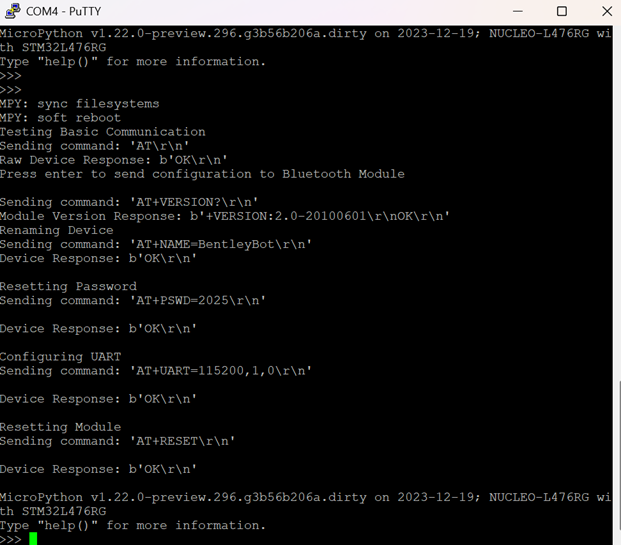

# Communication Tests

The following code was used for testing and initialization purposes for both the UART connection with the Raspberry Pi device and the bluetooth connection with the Android phone.

## UART
UART_ was tested utilizing a loopback test in `main.py`. After UART_ was confirmed working, tests were performed between the Raspberry Pi and STM32 Nucleo boards to ensure communication. 

### Test description and results
 Purpose: The purpose of this test is to ensure proper communication lines between the CPE team’s Raspberry Pi and the STM32 Nucleo to ensure flags in the code can be properly sent and received by each board and acted upon.

 Loopback Test: Ensures UART 3 is receiving and transmitting data properly by connecting the transmitter line to the receiver line on the STM32 board.
 
 

 

 Comms test between Raspberry Pi and STM32:

 

 
 
 

 *** The test failed dialogue on the STM’s serial monitor was in regard to the loopback test not the communication test between the Raspberry Pi and Nucleo
 

## Bluetooth
The `BT_confugurator.py` program was used to configure the HC-05 Bluetooth module. The program changes the standard baudrate of the device to 11500, sets the name of the bluetooth device and the password. 

### Test description and results
 Scope: This test validates the basic connection setup, configuration, and successful data transmission in both directions between an STM32 board and an Android phone via Bluetooth.

 Results on Serial Monitor:

 

 Results on Phone:

 
