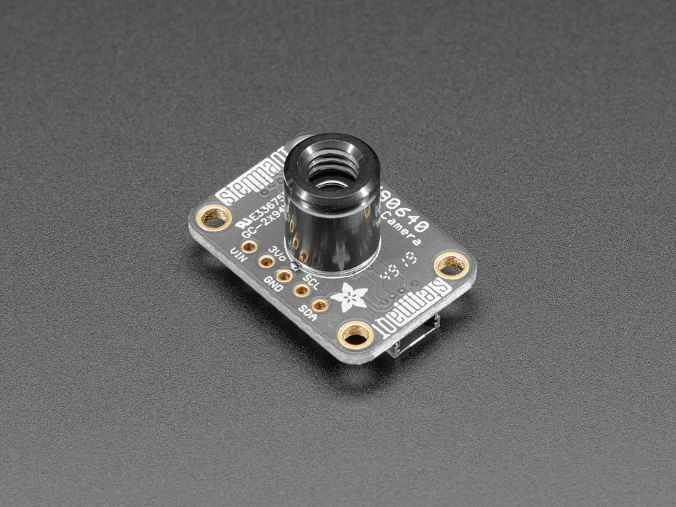

# Implementing the MLX90640 Thermal Infrared Camera

[MLX90640 Thermal Infrared Camera](https://www.adafruit.com/product/4407?srsltid=AfmBOopXb30Go0bubMpvIDiZCzZyr46Ge3ta_hf_qWBkuULyXO7aMHXZ)

As mentioned before, to allow the robot to track visitors’ faces and move to look at them, a new sensor would need to be added to the system. A thermal infrared sensor mounted to the robot’s head is recommended, specifically the MLX90640 thermal infrared camera. This sensor returns an array of 768 individual infrared temperature readings over I2C. A code class created by Dr. JR Ridgely pixelizes the data creating a thermal image. Since the human head produces the most heat, a person’s head should show up clearly in this thermal image. The centroid of the pixels of the visitor’s head could easily be calculated. Additionally, since the sensor would be mounted to the moving head of the robot, the robot could be controlled to move to align the centroid of a visitor’s head to the center pixel of the robot in real time using inverse kinematics and motion projection.

The following code is a simplified class that gets raw images, not calibrated ones, and displays it in ASCII art or in a CSV file. Further details on the class, how to use it, and simple examples can be found in Dr. JR Ridgley's documentation of the simplified class on the [ME405 Github Repository](https://github.com/spluttflob/ME405-Support/tree/36a0880c9371952473f5a6e82b29fab4140e809c/mlx_raw).