# Conversational Social Robot Utilizing LLMs
 Cal Poly SLO Mechanical Engineering Department Senior Project

 Sponsor: Dr. Eric Espinoza-Wade

 Code Author and Contributor: Mackenzie Goldman, EIT

# Table of Contents

[Background](#background)  
[Challenge and Goals](#challenge-and-goals)  
[Features](#features)  
[Mechanical System](#mechanical-system)  
[Electrical System](#electrical-system)  
  - [Overview](#overview)  
  - [Breakdown](#breakdown)  
  - [Electrical Schematic](#electrical-schematic)  
[User Guide](#user-guide)  
  - [Initial Setup](#initial-setup)  
  - [Using the Bently Bot](#using-the-bently-bot)  
  - [Troubleshooting the software](#troubleshooting-the-software)  
[Future Work and Known Issues](#future-work-and-known-issues)

## Background
<!--insert info about senior project at Cal Poly and specific things that were looked for within specific senior project (look at initial doc we were given adn presented by wade-->

Social robots are used in various settings such as healthcare, hospitality, and education to reduce the burden on human workers and expand opportunities for people in need of assistance. These social robots need to be capable of long-term human interactions by incorporating a large language model.

## Challenge and Goals

Create a humanoid robot head and torso capable of verbal communication with human users by incorporating traditional robotics principles such as sensing and motion with a trained large language model. The robot will be desk-mounted and stationary. The focus of the LLM conversation lies in using web-based information from the Cal Poly Digital Commons to discuss Cal Poly research past and current with visitors to the Bently Research Center.

Goals:
 - Construct a humanoid head and torso for the social robot
 - Include some level of interaction (e.g. rotate to 'look' at human speaker)
 - Facilitate bi-directional conversational interactions using an LLM

## Features
<!-- insert specific features of the robot in table format here -->

| Feature                | Description                                                      |
|------------------------|------------------------------------------------------------------|
| Humanoid Head & Torso  | Realistic robot head and torso for social interaction            |
| Motion Sensing         | Detects presence and movement of people                          |
| Head Movement          | Rotates to 'look' at the human speaker and nods head             |
| LLM Conversation       | Uses a large language model for bi-directional conversation      |
| Web Integration        | Discusses Cal Poly research using Digital Commons information    |
| Bluetooth Connectivity | Wireless communication with external devices                     |
| Emergency Stop         | Physical button for immediate shutdown                           |
| Emotive Gestures       | Robot expresses emotive faces and motion gestures                |

## Mechanical System

The mechanical system is described in detail in the FDR report. The following figure shows the CAD model.

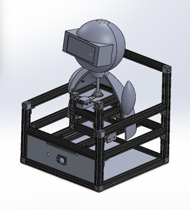

The final robot is shown below.

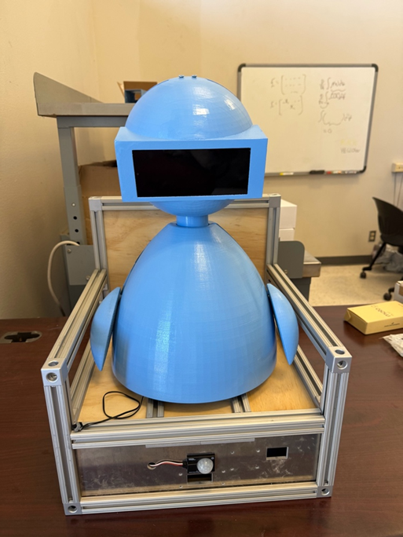

## Electrical System

Hardware:
  - STM32 L476RG Nucleo microcontroller board with Shoe of Brian attachment
  - Raspberry Pi 5 single board computer
  - Motorola Moto G Play 2024 Unlocked Android Phone
  - HC-05 Bluetooth Module
  - IR Sensor (MOT2002_0 from Phidgets)
  - E-Stop Button
  - DRV8838 Single Brushed DC Motor Driver Carrier
  - HS-5087MH Micro Digital HV Metal Gear Servo
  - Pololu 25D Brushed DC Metal Gearmotor

### Overview
To support AI-based conversation, a system consisting of a STM32 L476RG Nucleo microcontroller, a Raspberry Pi 5 single board computer, and a Motorola Android phone was developed. Figure 1 shows the distribution of tasks for the different hardware systems.

 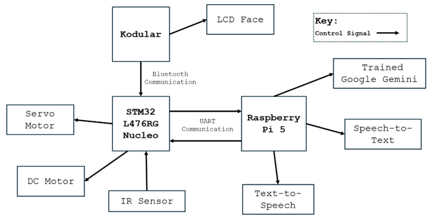
Figure 1. Task Distribution

The Raspberry Pi 5 was programmed and developed by the computer engineering (CPE) capstone team. The CPE capstone team trained the Google Gemini AI model to only respond to prompts and conversations about research at Cal Poly. This trained model as well as a Text-to-Speech, Speech-to-Text, speaker, and microphone were programmed onto the Raspberry Pi 5. The STM32 Nucleo board acts as the central control board interfacing between the Raspberry Pi 5 and all other systems on the robot such as the sensor, motors, and Android phone. It uses system level multitasking with each task centered around different finite state machines. The finite state machines for each task can be found in Appendix G. The STM32 microcontroller communicates with the Raspberry Pi 5 via a wired UART connection and with the Motorola Android phone through Bluetooth using a HC-05 Bluetooth module. The Android phone includes the Kodular app designed to change the robot’s faces based on different emotive cues. This synchronized system allows the robot to behave in a socially intuitive manner. 

### Breakdown

The overall control system was centered on the STM32 L476RG Nucleo microcontroller. This board was mounted to a Shoe of Brian PCB which acted as an interpreter. Natively, the STM32 Nucleo board runs C++, but the addition of the Shoe of Brian PCB allowed MicroPython firmware to be installed on the board and Python scripts to be run from the standard libraries. Figure 2 shows a simplified wiring diagram of the system currently implemented in the robot.

 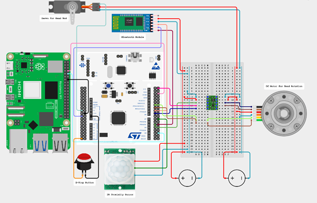
Figure 2. Simplified Wiring Diagram

A micro servo controlled the head nodding mechanism. The micro servo did not have external encoder feedback data which complicated the control system. To control the range of motion of the head nod mechanism, appropriate pulse width modulation (PWM) limits were identified, and a calculated estimate of the corresponding angle were determined. As the servo motor did not have external encoder feedback, out of range motions were difficult to limit and were based on an open loop control system. Additionally, homing upon initialization of the servo motor was impossible to achieve. Homing of the servo motor would have taken the current position of the servo motor and moved it to a prespecified angle following a 5th order spline motion upon startup of the program therefore eliminating the jerk and jump of the servo motor. 

A brushed DC motor controlled the head rotation mechanism. A TI DRV8838 utilizing a tiny H-bridge motor driver integrated circuit allowed the DC motor to be controlled by the STM32 Nucleo’s PWM control signal. The DC motor had an external encoder allowing for a closed loop control system to be developed based on the parameterization of the motor found in Appendix D. A PID controller was used to ensure the DC motor did not overshoot and move out of the specified range of motion.

A 10-meter IR sensor mounted in the robot’s chair detected visitor motion through analog voltage feedback. Communication between the two boards and the phone was established through two different methods. The Raspberry Pi 5 and STM32 Nucleo boards communicated over a wired serial UART connection. Start and kill messages were transmitted between the two boards depending on the required state. Additionally, emotion flags such as “HAPPY” and “TALKING” were transmitted to the STM32 board. These emotion flags were determined by different states in the Raspberry Pi 5’s programming. The phone and STM32 board communicate wirelessly through Bluetooth. Since the STM32 board does not have built-in Bluetooth capabilities, a HC-05 Bluetooth module was wired through UART to the board to provide full-duplex. The STM32 board sends the emotion flags from the Raspberry Pi 5 to the phone. The phone, which served as the robot’s face, ran a Kodular-based application responsible for expressing the robot’s emotions. The different communication methods were tested, and the results and procedures are shown in Appendix D.

 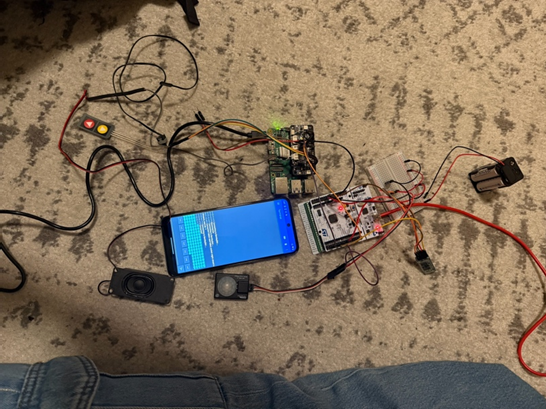
Figure 3. Communication Testing 

An emergency stop button was incorporated into the design. Typical E-stop design eliminates all power to the system cutting off all movement and operation. It also includes a button that once pressed needs to be twisted and lifted to reset and provide power to the system. It is important to note that E-stop buttons are included in any moving machine. The E-stop designed for this system does not follow these standards on the account that the robot no longer has a movement function. If movement was restored to the robot, a traditional E-stop would need to be implemented. The current E-stop sends the kill signal to both the phone and Raspberry Pi 5 before stopping the STM32’s main program as an interrupt. The debounce on the button was modified to mimic a traditional E-stop. Essentially, to restart the program and reinstate functionality, the E-stop button needs to be pressed a second time before restarting the STM32’s main program.

The STM32 board and the servo motor were powered by 2 buck converters. These were powered by a standard wall outlet which was converted to DC power through an adapter cord. The first buck converter was stepped down to roughly 5 V to accommodate the needs of the board. This was connected to a breadboard with jumper wires allowing the board to draw power. The second buck converter was set to roughly 7 V to accommodate the increased power requirement of the servo motor.

### Electrical Schematic

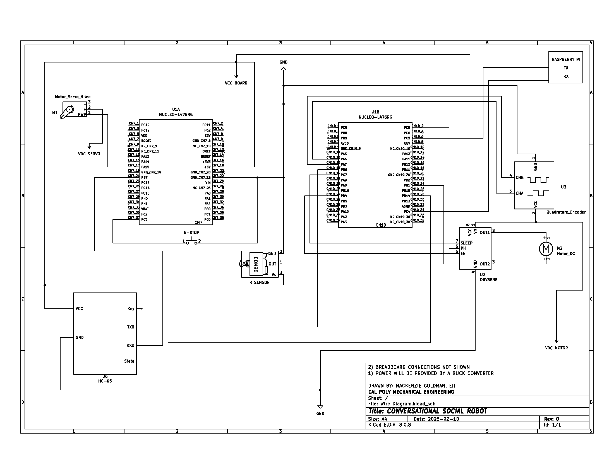

## User Guide

> [!IMPORTANT]
> Code structures and programs in the repository are solely for the STM32 L476RG Nucleo board. The documentation for the Raspberry Pi 5 code and Kodular program are stored elsewhere.

Code Hierarchy:
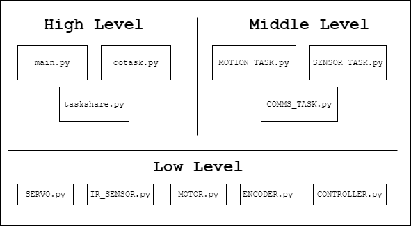

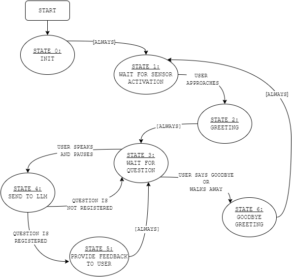
Behavioural State Machine

Each task has it's own Finite State Machine.
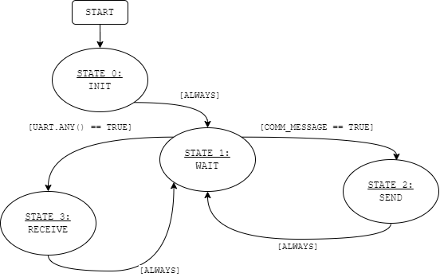
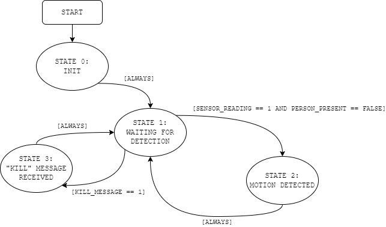
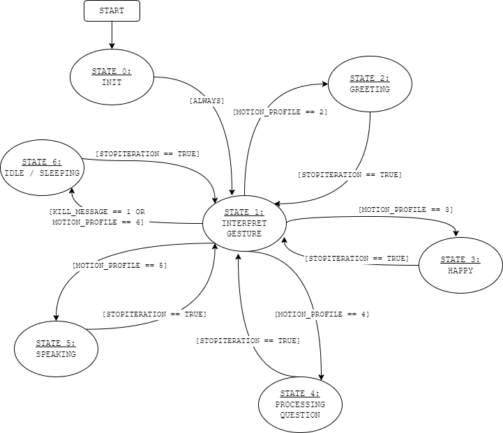

Task Diagram
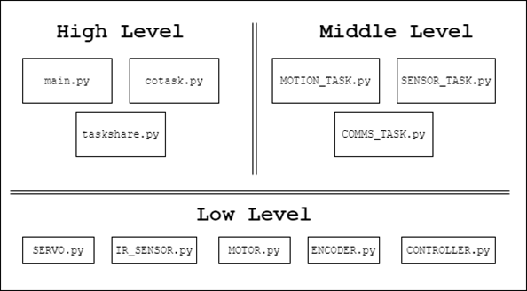 

To use the repository, download all python scripts from the Code file and push them to the STM32 board.

### Initial Setup
1.	Plug in the two power cords and the phone cord into an outlet
2.	SSH or connect a monitor and keyboard to the Raspberry Pi 5 board. Refer to CPE Team’s user manual for further instructions.
3.	Once connected to the Raspberry Pi 5, type in username and password found in the CPE Team’s documentation.
4.	Open a terminal on the Raspberry Pi and run “source env/bin/activate”
5.	Run “python3 llmrobot.py” to start the FSM.
6.	Unlock the phone and open the “Bently Bot” app with the icon below.
 
7.	Click the grey “connect” button on the screen to connect to Bluetooth
 
8.	Once connected, the robot is ready to interact!

### Using the Bently Bot
**Approaching the Bently Bot**
1.	Carefully approach the robot so that you are within a 10-foot radius of its front side
2.	If sensors are properly functioning, you should see the facial features of the robot change from “resting” to “smile.” This should also trigger the head nod function of the robot as it lifts its head from a resting position.

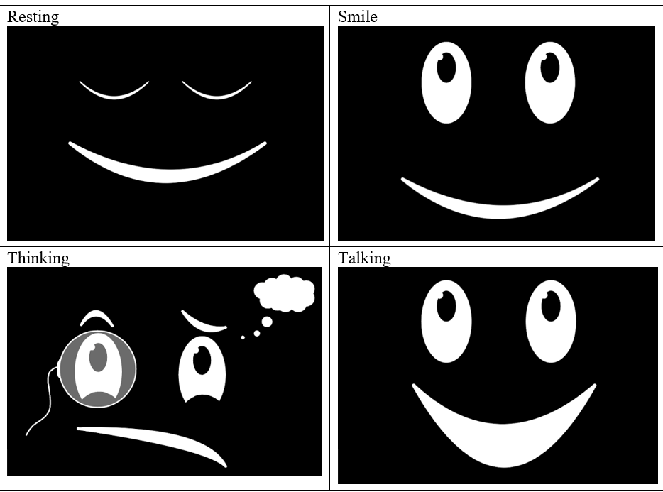

**Speaking to the Bently Bot**
1.	When asking the robot a question, limit the topics of conversation to Cal Poly or the Bently Center, as any inappropriate questions will automatically be dismissed by the robot
2.	If the STM32 Nucleo boards are working correctly, the Bently Bot’s face should change to the “Thinking” face after receiving the inquiry.

**Using the E-stop Button**
1.	If E-stop is pressed, the “main.py” program on the STM32 board will shut down.
2.	To reset the system after the E-stop is pressed:
    a.	While the power is still going to the system, press the E-stop button again.
    b.	Disconnect power to the STM32 board and then reconnect power.
    c.	The Bluetooth connection between the STM32 board and phone will disconnect.
    d.	Exit and close fully out of the “Bently Bot” app.
    e.	Reenter the app and press connect.
    f.	The robot should be good to go again.

### Troubleshooting the software

**Troubleshooting Bluetooth:** 
If the phone is unable to connect to the HC-05 Bluetooth module named “BentlyBot”, it is likely the Bluetooth module needs to reconnect to the phone’s settings or in worst case, the module needs to be reset.

1.	To reconnect the phone’s settings to the “BentlyBot” Bluetooth signal, go into the phones settings application and find the Bluetooth settings.
2.	Click the “BentlyBot” Bluetooth signal and choose to “forget device”.
3.	Go back into the phone’s Bluetooth settings and click to pair a new device.
4.	Pair with the “BentlyBot” signal. If the connection is made, the HC-05 Bluetooth module should blink about two blinks every two seconds (see image with yellow highlight for location of LED on the HC-05).
5.	If the Bently Bot app connects to Bluetooth, no further actions are necessary. 
6.	If the Bently Bot app does not connect to Bluetooth or the HC-05 Bluetooth module is blinking rapidly or not at all, a full reset of the HC-05 device is likely necessary.
 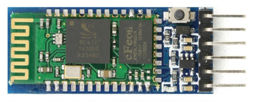
7.	To reset the HC-05 device, download the BT_configurator.py file and rename it main.py.
8.	Either disconnect all peripherals except the HC-05 or use a STM32 Nucleo with nothing else plugged into it.
9.	Disconnect the power to the Nucleo and HC-05.
10.	Using a jumper wire connect the “EN” pin on the HC-05 to pin “PA0” on the Nucleo.
11.	While holding down the enable button (see image below) on the HC-05, connect power to the Nucleo and HC-05. Continue holding down the enable button until you get a very slow blink on the Bluetooth module’s LED (about 2 seconds on / 2 seconds off).
 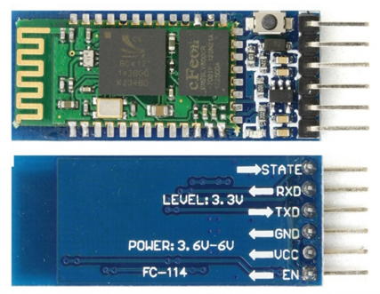
12.	Transfer the BT_configurator.py file now named main.py onto the Nucleo and run the code from PuTTY to send the configuration to the module. If everything worked, you should see this on your serial terminal:
 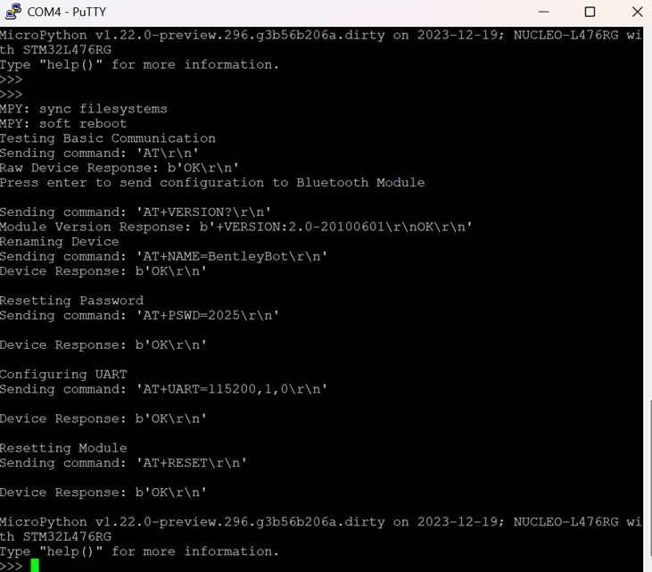
13.	If you do not see this on your serial terminal, you should try using a new HC-05 Bluetooth module and repeating the reset steps.
14.	Disconnect power to the Nucleo and HC-05 device and disconnect the jumper wire connecting the “EN” pin to “PA0”.
15.	Reflash main.py onto the board and rerun the program. The phone should now be able to connect to the Bluetooth signal.

**Troubleshooting Code:** 
If all other aspects of the Bently Bot have been troubleshooted and the problem persists, first check the wire connections as described below, then reset the STM32 Nucleo. 

Checking Wired Connections:
1.	From the back of the chair, remove the STM32 board and breadboard.
2.	Remove the back shells from the body and head of the robot.
3.	On the STM32 board, ensure the wire headers are snugly fastened to the board’s Morpho pin headers. 
4.	If any wire has come loose from the board’s Morpho pin headers, follow the wiring diagram to reattach the wire.
    a.	Check if the problem has been resolved.
5.	Following the same procedure, ensure the wires are secured on the breadboard.
    a.	If wires are consistently coming loose from the breadboard, a proto board may be substituted in for the breadboard and the wires soldered on.
6.	Follow each wire up through its path checking for any damage in the wire. Wires may be connected to another set of wires through heat shrink tubing. The heat shrink tubing is a measure to prevent wires from separating. If damaged, replace wire and heat shrink tubing.

Resetting the STM32 Nucleo:
To reset the STM32 Nucleo board, press the black “Reset” button on the board as shown highlighted in yellow.
 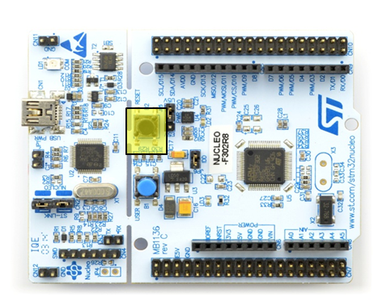
If the STM32 Nucleo device is reset or a new device is used, the following steps will allow python to be run through the Shoe of Brian and on the STM32 board.
1.	Download the firmware.bin file from Github.
2.	Install the STM Cube Programmer.
3.	Unplug the STM32 Nucleo from all power sources.
4.	Move the jumper named JP5 from the “E5V” to the “U5V” position. That is, remove the small black rectangular shorting block and move it over one pin and reinsert it to short out the middle pin with “U5V” instead of “E5V”.
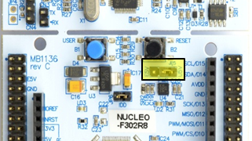
5.	Connect the Nucleo to your computer with the ST-Link USB port, not the regular USB port on the Shoe of Brian.
6.	Open the STM Cube Programmer and select the firmware.bin file.
7.	Press the “connect” button on the top right corner of the program. If this fails to connect, its possible the board is damaged, or you may have the jumper not set to “U5V”.
 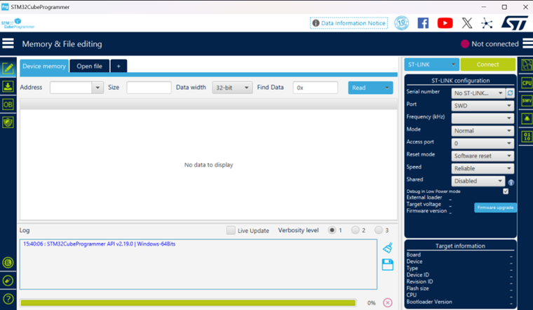
8.	Occasionally, software running on the Nucleo can lock out the ST-Link. If you think that may be the case, then attempt to connect several times while holding down the black reset button, releasing it approximately as you click on connect in the program.
9.	Once connected, press the button near the bottom left corner of the STM Cube Programmer shaped like an eraser to perform a “full chip erase”. If this step fails, your Nucleo is most likely damaged.
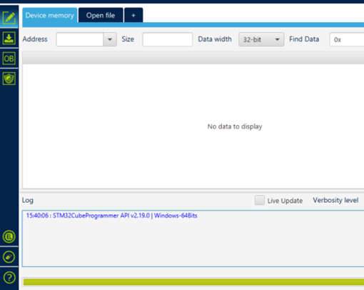
 
10.	 If the chip erase is successful, press the “download” button to flash the interpreter firmware.
11.	Once the programming is completed successfully, press the “disconnect” button in the programmer utility.
12.	Disconnect the USB cord from the ST-Link.
13.	Replace the jumper back on the “E5V” side so that you can use the Shoe of Brian once again.
14.	Confirm that you can access the REPL through PuTTY or any other serial communication port and that the PYBFLASH drive mounts properly.
15.	Reflash all code files from “Code” onto the STM32 device.

**Further Troubleshooting:**
It may be possible that the STM32 Nucleo board is damaged. 
1.	Visually inspect the Nucleo board for physical damage.
2.	If the ST-Link (the yellow highlighted part of the board) if broken off or partially snapped off the board, the board is damaged, and a replacement will need to be ordered. Follow the directions for resetting the Nucleo to prepare the new board.
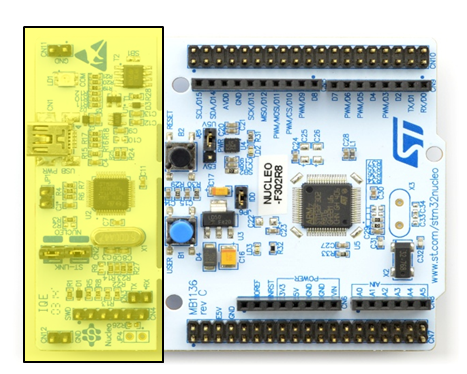  
3.	Look for any obvious signs of damage like burn marks, discoloration, or even physical damage to the chip. Also inspect other components like resistors and inductors. 
4.	If any burn marks or discoloration are present, the board might be fried, and a replacement board will be needed.

<!--
https://docs.github.com/en/get-started/writing-on-github/getting-started-with-writing-and-formatting-on-github/basic-writing-and-formatting-syntax

https://www.makeareadme.com/

-->

## Future Work and Known Issues

Over the course of 3 quarters, a humanoid robot capable of holding real-time conversations, expressing facial emotions, and engaging with visitors through interactive movements was ideated, analyzed, designed, and manufactured. Though the robot is currently unable to move, the mechanical systems are still present in the final robot. Recommendations and further work will be highlighted on how to improve functionality and troubleshoot current issues.

A solution the team offers to the issue of the servo motor stalling would be to integrate the Hitec HS-788HB servo motor seen in Figure 1 with a no-load torque of 153 oz-in (9.6 lb-in) more than fulfilling the requirement for this project. 

 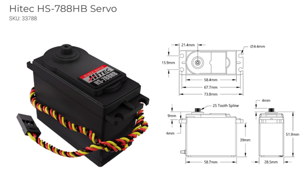
Figure 1. New Servo Motor

This servo still does not have an external encoder feedback signal. To properly track faces as detailed below, creating a closed loop control system with either a PID controller on an external encoder or an estimator controller would be vital to develop. To implement the head rotation function, new plates could be waterjet with a higher tolerance to ensure the press fit is possible. These recommendations would allow the system to move.

To allow the robot to track visitors’ faces and move to look at them, a new sensor would need to be added to the system. A thermal infrared sensor mounted to the robot’s head is recommended, specifically the MLX90640 thermal infrared camera. This sensor returns an array of 768 individual infrared temperature readings over I2C. A code class created by Dr. JR Ridgely pixelizes the data creating a thermal image. Since the human head produces the most heat, a person’s head should show up clearly in this thermal image. The centroid of the pixels of the visitor’s head could easily be calculated. Additionally, since the sensor would be mounted to the moving head of the robot, the robot could be controlled to move to align the centroid of a visitor’s head to the center pixel of the robot in real time using inverse kinematics and motion projection. The code class and library are detailed further in the Future_Works_MLX_Cam folder.

When integrating the Raspberry Pi 5 board with the STM32 board, a few issues were determined. An extra wire on the Raspberry Pi 5 board is soldered to the board. This wire does not plug into anything, but it is critical that this wire is always grounded to the power source. If desired, the wire could also be desoldered from the board. If this wire is not removed or grounded, it causes immense electromagnetic interference in the UART communication line as well as the speaker. Since the wire sits between the transmitter and receiver UART wires, it acts as an active antenna amplifying any noise in the system. This causes crackling in the speaker and “garbage” data to be transmitted to the STM32 board. The noise in the system without this wire is limited, but if additional buck converters were added to the system, electromagnetic interference (EMI) would increase as well. If the EMI was great enough, a Faraday cage may be needed to prevent the noise from traveling into the system. 

Another issue identified when integrating the systems was that errors that stop the “main” program on the STM32 or Raspberry Pi 5 do not stop the program on the other board. This does not actively harm the system but actively monitoring both programs as they run is the only way to catch when this occurs and reset the program.

Further, due to the nature of the finite state machine (FSM) program developed on the Raspberry Pi 5 with blocking code on one thread, the E-stop button does not immediately cut off the conversation. The Raspberry Pi 5 code operates on a multithreading system where one thread watches for incoming UART messages and feeds them to the second thread running the main FSM. Many of the states in the FSM contain blocking code to allow the program to run the LLM, speak, and listen. Since the code is blocking, the received “Kill” command is not processed until the state changes. This could be fixed by further work on the Raspberry Pi 5 code.

A timing delay in the processing of the face changes on the Kodular app was identified. The Kodular program has a lengthy delay between emotion change flags sent to the phone and when the face itself changes. The current handling of the Bluetooth messages in the Kodular app uses the “Clock” feature to continuously poll the Bluetooth client. This method is known to have a significant lag in processing. To improve this timing delay, two solutions are proposed. The first is to use the “BytesAvailableToReceive” block instead of the clock to check if data is available before sending the received data to further processing. The second solution aims to reduce the logic in the “Clock.Timer” or “ReceiveText” handlers and complete the logical checks elsewhere.

An issue with the “Talking” face on Kodular was identified where the video will play one time but not loop as it is supposed to until receiving the next emotion flag. Further work would need to be explored, to troubleshoot this issue.

Finally, the phone itself and Kodular app both timeout after 30 minutes. The specific phone type does not allow for an indefinite screen lock time. The phone will shut off after 30 minutes maximum. The Kodular app will similarly timeout after 30 minutes and need to be fully closed down before restarting the app. Further work into these issues could be completed to allow continuous use of the system for greater than 30 minutes.

The highlighted issues and solutions could be expanded in future work to improve and develop a seamless system.
